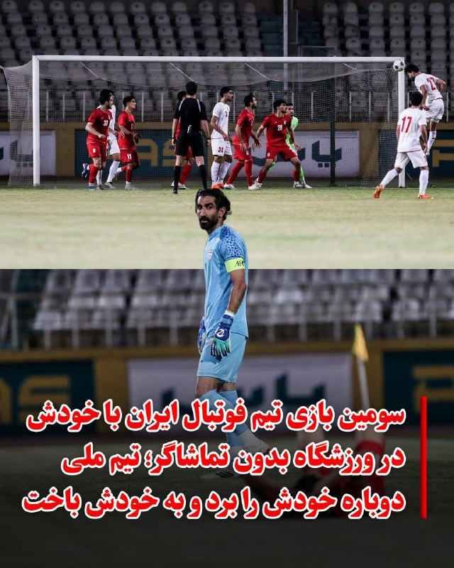
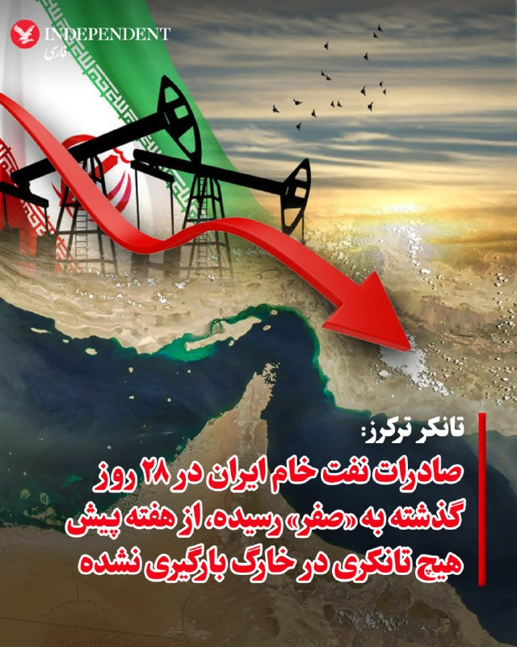

# خواننده تلگرام

<!-- TOP_NAV START -->

<a href="https://github.com/Amir1796/aio-downloader/blob/main/telegram/content/archive_1.md" style="display:inline-block; padding:6px 12px; margin:0 4px; background-color:#2ea44f; color:white; text-decoration:none; border-radius:4px; font-weight:bold;">صفحه بعد</a>

<!-- TOP_NAV END -->

<!-- MSG START -->

---
📅 بروزرسانی: 1405/02/23 03:06
---

## VahidOOnLine — post 239815

  <a href="telegram/content/VahidOOnLine_239815_1778629003.mp4" target="_blank">🎬 Download video</a>

محمدرضا شهبازی، مجری صداوسیما، در واکنش به انتقادها از وضعیت اینترنت در ایران و مقایسه آن با راه‌اندازی اینترنت ۵جی در افغانستان و آغاز استفاده از کارت‌های بین‌المللی در سوریه، با لحنی تمسخرآمیز گفت: «اگر این چیزها این‌قدر مهم است، بروید همان‌جا (سوریه و افغانستان) زندگی کنید.»
‌🏁 🇬🇧 IranintlTV

🤖 @VahidOOnLine

## VahidOOnLine — post 239814

  

مایک والتز، سفیر آمریکا در سازمان ملل، با بازنشر تهدیدهای اخیر ابراهیم عزیزی، نماینده مجلس، علیه کشورهای منطقه درباره بستن دائمی تنگه هرمز، در ایکس نوشت جمهوری اسلامی به این دلیل کشورهای منطقه و اقتصاد جهانی را تهدید می‌کند که شورای امنیت مسیر دیپلماسی را انتخاب کرده است.
او نوشت: «جای تعجب ندارد که جمهوری اسلامی آشکارا همسایگان خود را تهدید می‌کند و اذعان می‌کند که به مین‌گذاری در آب‌های بین‌المللی و حمله به کشتی‌های تجاری از سراسر جهان ادامه خواهد داد، با این امید که ویرانی اقتصادی ایجاد کند.»
والتز افزود: «همه این‌ها به این دلیل است که ما در شورای امنیت سازمان ملل مسیر دیپلماسی را انتخاب کرده‌ایم. این اظهارات یک مقام حکومت ایران نشان می‌دهد چرا قطعنامه شورای امنیت علیه تهران لازم است و چرا هرگز به جمهوری اسلامی اجازه داده نخواهد شد به سلاح هسته‌ای دست یابد.»

‌🏁 🇬🇧 IranintlTV

🤖 @VahidOOnLine

## VahidOOnLine — post 239813

  

♦️تیم ملی فوتبال ایران در پی انزوای بین‌المللی و انصراف تمامی حریفان تدارکاتی از جمله پرتغال، اسپانیا، مقدونیه و آنگولا، برای سومین بار به مصاف خود رفت. این دیدار درون‌تیمی که عصر سه‌شنبه ۲۲ اردیبهشت در ورزشگاه پاس قوامین (متعلق به نیروی انتظامی) برگزار شد، در غیاب تماشاگران عادی و با پخش مستقیم از صداوسیما همراه بود.
در این مسابقه که در قالب دو تیم سفید و قرمز انجام شد، تیم سفید با نتیجه ۴ بر ۱ به پیروزی رسید. علی علیپور، دانیال ایری (دو بار) و آریا یوسفی برای سفیدپوشان و امیرحسین حسین‌زاده برای تیم قرمز گلزنی کردند. این سومین بار است که بازیکنان تیم ملی به دلیل پیدا نکردن حریف خارجی، در قالب مسابقات درون‌تیمی مقابل هم صف‌آرایی می‌کنند.
فدراسیون فوتبال در حالی از برگزاری بازی با «گامبیا» در اردوی آینده ترکیه خبر داده که پیش از این تمامی قرارهای ملاقات با تیم‌های صاحب‌نام فوتبال جهان لغو شده است.
‌🇸🇦 Indypersian

🤖 @VahidOOnLine

## VahidOOnLine — post 239812

  

♦️«تانکر ترکرز»، سامانه رصد موقعیت نفتکش‌ها، روز سه‌شنبه در گزارشی اعلام کرد که بر اساس داده‌های موجود، تهران در ۲۸ روز گذشته موفق به صادرات دریایی نفت خام نشده است و تنها برخی فرآورده‌های نفتی به‌دلیل اعمال نشدن تحریم‌های دفتر کنترل دارایی‌های خارجی آمریکا (اوفاک) بر تانکرهای حامل آن‌ها، از منطقه خارج شده‌اند. این گزارش همچنین با اشاره به تداوم توقف بارگیری در جزیره خارگ از ۱۶ اردیبهشت‌ماه به دلیل نشت نفت، که پیش‌تر توسط مقامات تهران تکذیب شده بود، تاکید کرد که در حال حاضر تعداد زیادی نفتکش خالی و پر در هر دو سوی خط محاصره دریایی ایالات متحده حضور دارند. تانکر ترکرز تصریح کرد که خروج موفقیت‌آمیز و صادرات تنها زمانی محقق می‌شود که «یک نفتکش از خط محاصره نیروی دریایی آمریکا عبور کرده و بدون محموله به منطقه بازگردد».
‌🇸🇦 Indypersian

🤖 @VahidOOnLine

## FoxNewsTwitter — post 341620

  <a href="telegram/content/FoxNewsTwitter_341620_1778629007.mp4" target="_blank">🎬 Download video</a>

Fox News (Twitter/X)

FOX NEWS REPORT: There are now 11 suspected cases of Hantavirus worldwide — all among passengers from the MV Hondius cruise ship, reports @BillMelugin_ .

## IranIntlTV — post 336906

  <a href="telegram/content/IranIntlTV_336906_1778629010.mp4" target="_blank">🎬 Download video</a>

محمدرضا شهبازی، مجری صداوسیما، در واکنش به انتقادها از وضعیت اینترنت در ایران و مقایسه آن با راه‌اندازی اینترنت ۵جی در افغانستان و آغاز استفاده از کارت‌های بین‌المللی در سوریه، با لحنی تمسخرآمیز گفت: «اگر این چیزها این‌قدر مهم است، بروید همان‌جا (سوریه و افغانستان) زندگی کنید.»

## IranIntlTV — post 336905

  <a href="telegram/content/IranIntlTV_336905_1778629012.mp4" target="_blank">🎬 Download video</a>

هزینه‌ای که جمهوری اسلامی به مردم ایران تحمیل کرده، فقط در اقتصاد خلاصه نمی‌شود؛ از سفره‌های کوچک‌تر تا اینترنت طبقاتی، از اعدام و زندان تا ترس، ناامیدی و خشم فروخورده‌ای که هر روز بزرگ‌تر می‌شود. مردم تا کی تاب می‌آورند؟ آیا ایران به نقطهٔ انفجار رسیده است؟ خشم انباشتهٔ مردم چه زمانی فوران خواهد کرد؟

کامبیز حسینی در «برنامه» به این موضوع می‌پردازد.

«یک ایران صدای شما را می‌شنود»

دوشنبه تا پنجشنبه ۱۱ شب تهران

از تلویزیون ایران اینترنشنال

تماشای نسخه کامل این قسمت از «برنامه» در یوتیوب:

https://youtu.be/964Hz45DLwM

@iranintltv

## IranIntlTV — post 336904

  <a href="telegram/content/IranIntlTV_336904_1778629014.mp4" target="_blank">🎬 Download video</a>

عرفان شکورزاده، دانش‌آموختهٔ ۲۹ سالهٔ مهندسی هوافضا از دانشگاه علم‌وصنعت، با اتهام «جاسوسی» اعدام شد؛ اتهامی که جمهوری اسلامی دربارهٔ جزئیات و مدارک آن، توضیح شفافی ارائه نکرده است.

رسانه‌های حکومتی مدعی همکاری او با موساد و آمریکا شدند، اما فعالان حقوق بشر می‌گویند او ماه‌ها در انفرادی بوده و تحت فشار، مجبور به اعتراف اجباری شده است.

کامبیز حسینی در «برنامه» به این موضوع می‌پردازد.

«یک ایران صدای شما را می‌شنود»

دوشنبه تا پنجشنبه ۱۱ شب تهران

از تلویزیون ایران اینترنشنال

تماشای نسخه کامل این قسمت از «برنامه» در یوتیوب:

https://youtu.be/964Hz45DLwM

@iranintltv

## IranIntlTV — post 336903

  <a href="telegram/content/IranIntlTV_336903_1778629016.mp4" target="_blank">🎬 Download video</a>

سحر از تهران: ۱۸ دی به همسرم چاقو زدند؛ نتوانستیم از عهدهٔ درمانش بربیاییم.از کجا بیاوریم؟

«یک ایران صدای شما را می‌شنود»

دوشنبه تا پنجشنبه ۱۱ شب تهران

از تلویزیون ایران اینترنشنال

تماشای نسخه کامل این قسمت از «برنامه» در یوتیوب:

https://youtu.be/964Hz45DLwM
@iranintltv

## IranIntlTV — post 336902

  

مایک والتز، سفیر آمریکا در سازمان ملل، با بازنشر تهدیدهای اخیر ابراهیم عزیزی، نماینده مجلس، علیه کشورهای منطقه درباره بستن دائمی تنگه هرمز، در ایکس نوشت جمهوری اسلامی به این دلیل کشورهای منطقه و اقتصاد جهانی را تهدید می‌کند که شورای امنیت مسیر دیپلماسی را انتخاب کرده است.
او نوشت: «جای تعجب ندارد که جمهوری اسلامی آشکارا همسایگان خود را تهدید می‌کند و اذعان می‌کند که به مین‌گذاری در آب‌های بین‌المللی و حمله به کشتی‌های تجاری از سراسر جهان ادامه خواهد داد، با این امید که ویرانی اقتصادی ایجاد کند.»
والتز افزود: «همه این‌ها به این دلیل است که ما در شورای امنیت سازمان ملل مسیر دیپلماسی را انتخاب کرده‌ایم. این اظهارات یک مقام حکومت ایران نشان می‌دهد چرا قطعنامه شورای امنیت علیه تهران لازم است و چرا هرگز به جمهوری اسلامی اجازه داده نخواهد شد به سلاح هسته‌ای دست یابد.»

https://iranintl.com/202605120656

## IranIntlTV — post 336901

  <a href="telegram/content/IranIntlTV_336901_1778629019.mp4" target="_blank">🎬 Download video</a>

آیدا از تهران: من ترجیح می‌دهم در راه آزادی کشورم بمیرم تا از گرسنگی

«یک ایران صدای شما را می‌شنود»

دوشنبه تا پنجشنبه ۱۱ شب تهران

از تلویزیون ایران اینترنشنال

تماشای نسخه کامل این قسمت از «برنامه» در یوتیوب:

https://youtu.be/964Hz45DLwM
@iranintltv

## IranIntlTV — post 336900

  <a href="telegram/content/IranIntlTV_336900_1778629021.mp4" target="_blank">🎬 Download video</a>

محمد از مشهد: در مشهد، سر صف بنزین مردم با هم درگیر می‌شوند که معلوم است از انباشت خشم است

«یک ایران صدای شما را می‌شنود»

دوشنبه تا پنجشنبه ۱۱ شب تهران

از تلویزیون ایران اینترنشنال

تماشای نسخه کامل این قسمت از «برنامه» در یوتیوب:

https://youtu.be/964Hz45DLwM

@iranintltv

## IranIntlTV — post 336899

  <a href="telegram/content/IranIntlTV_336899_1778629023.mp4" target="_blank">🎬 Download video</a>

امیر از خمین: رفتم مخابرات و گفتم توانایی مالی اینترنت را ندارم و خواهش کردم قطع کنند

«یک ایران صدای شما را می‌شنود»

دوشنبه تا پنجشنبه ۱۱ شب تهران

از تلویزیون ایران اینترنشنال

تماشای نسخه کامل این قسمت از «برنامه» در یوتیوب:

https://youtu.be/964Hz45DLwM
@iranintltv

## FarsiVOA — post 217582

⚡️گشت‌وگذار خبرنگار اسرائیلی در بغداد و اعتراف ارتش عراق به ایجاد پایگاه در صحرای نجف توسط اسرائیل
@FarsiVOA

## Persian_Trend_Official — post 14023

  <a href="telegram/content/Persian_Trend_Official_14023_1778629025.mp4" target="_blank">🎬 Download video</a>

شبتون بخیر ❤️🔥

📝 Nick
📌 @persian_trend_official
پرشین ترند | متفاوت‌ترین کانال نظامی

<!-- MSG END -->

<!-- NAV START -->

<a href="https://github.com/Amir1796/aio-downloader/blob/main/telegram/content/archive_1.md" style="display:inline-block; padding:6px 12px; margin:0 4px; background-color:#2ea44f; color:white; text-decoration:none; border-radius:4px; font-weight:bold;">صفحه بعد</a>

<!-- NAV END -->
