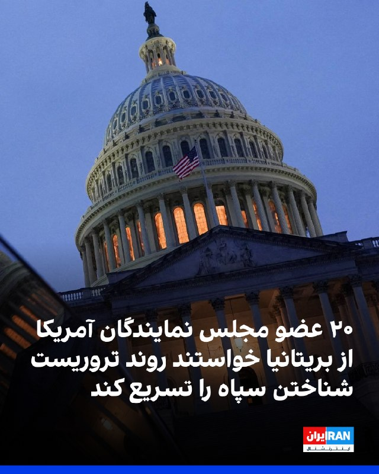
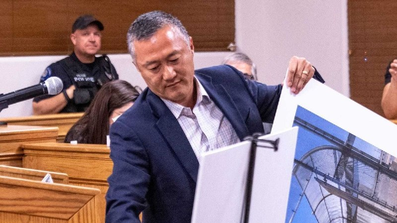
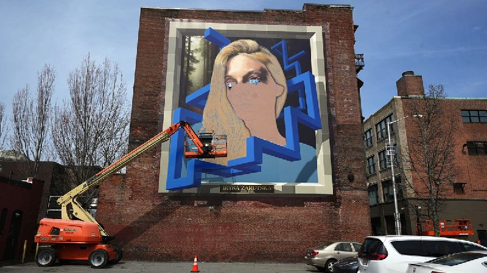

# خواننده تلگرام

<!-- TOP_NAV START -->

<a href="https://github.com/Amir1796/aio-downloader/blob/main/telegram/content/archive_1.md" style="display:inline-block; padding:6px 12px; margin:0 4px; background-color:#2ea44f; color:white; text-decoration:none; border-radius:4px; font-weight:bold;">صفحه بعد</a>

<!-- TOP_NAV END -->

<!-- MSG START -->

---
📅 بروزرسانی: 1405/02/23 04:59
---

## VahidOOnLine — post 239832

  

«کنگره ملی کردستان»، نهاد فراگیر تشکل‌های کُرد، با رد اظهارات ترامپ مبنی بر ارائه سلاح به گروه‌های کُرد برای مقابله با جمهوری اسلامی، هشدار داد چنین اظهاراتی خطر ایجاد یک کارزار خصمانه هماهنگ علیه مردم کُرد را به همراه دارد.
این بیانیه افزود: «طرح چنین اتهام‌های گسترده و کلی، همه کردها را در معرض سوءظن قرار می‌دهد و خطر تضعیف روابط کردها و آمریکا را در پی دارد. ما به عنوان کنگره ملی کردستان این اتهام‌ها را رد می‌کنیم و آن‌ها را جدی و بالقوه زیان‌بار می‌دانیم.»

‌🏁 🇬🇧 IranintlTV

🤖 @VahidOOnLine

## VahidOOnLine — post 239831

  

۲۰ عضو دموکرات و جمهوری‌خواه مجلس نمایندگان آمریکا در نامه‌ای به دولت بریتانیا، از این کشور خواستند روند تصویب قانونی قرار دادن سپاه به عنوان یک سازمان «تروریستی» را تسریع کند.
برد شرمن، عضو دموکرات مجلس نمایندگان آمریکا و از مبتکران تهیه این نامه، گفت: «هر روزی که پارلمان بریتانیا تاخیر می‌کند، سپاه پاسداران یک روز دیگر از تاثیر کامل تحریم‌های مشترک ما می‌گریزد. بریتانیا باید در سمت درست تاریخ بایستد و سپاه پاسداران را در ارتباط با اقداماتش در سراسر جهان پاسخگو کند.»
کلودیا تنی، عضو جمهوری‌خواه مجلس نمایندگان و از مبتکران تهیه این نامه، گفت: «سپاه پاسداران یکی از خطرناک‌ترین سازمان‌های تروریستی جهان است و دستانش به خون غیرنظامیان بی‌گناه، آمریکایی‌ها و مخالفان آلوده است.»
او افزود: «حکومت ایران همچنان از طریق سپاه پاسداران و شبکه‌های نیابتی آن، ترور را صادر می‌کند، متحدان ما را تهدید می‌کند و مردم خود را به‌طور بی‌رحمانه سرکوب می‌کند. بریتانیا باید فورا به آمریکا و متحدانش بپیوندد و پیام روشنی بفرستد که جهان غرب ترور، خشونت سیاسی یا یهودستیزی را تحمل نخواهد کرد.»
‌🏁 🇬🇧 IranintlTV

🤖 @VahidOOnLine

## VahidOOnLine — post 239830

  

♦️مراسم افتتاحیه هفتادونهمین دوره جشنواره فیلم کن با حضور چهره‌های برجسته سینمای جهان، روز سه‌شنبه، ۲۲ اردیبهشت‌ماه، آغاز شد. در این مراسم که با استقبال گسترده رسانه‌ها همراه بود، فیصل بالطیور، مدیر اجرایی بنیاد فیلم دریای سرخ، به همراه پیتر جکسون، برنده نخل طلای افتخاری، الایجا وود و اعضای هیئت داوران از جمله پارک چان-ووک، دمی مور و کلوئی ژائو بر روی فرش قرمز حضور یافتند. جشنواره کن به مدت ۱۲ روز ادامه خواهد داشت و دوم خردادماه با معرفی برندگان نخل طلا به کار خود پایان می‌دهد.
بنیاد فیلم دریای سرخ عربستان سعودی در جشنواره کن با پنج فیلم تحت حمایت‌ «صندوق دریای سرخ» و «بازار دریای سرخ» حضور خواهد داشت. این آثار عبارت‌اند از «داستان‌های موازی» ساخته اصغر فرهادی، «توت‌فرنگی» ساخته لیلا مراکشی، «دیروز چشم نخوابید» ساخته راکان میاسی، «بنیمانا» ساخته ماری کلمنتین دوسابجامبو و «دختر ناشناس» ساخته زو جینگ.
‌🇸🇦 Indypersian

🤖 @VahidOOnLine

## VahidOOnLine — post 239829

  <a href="telegram/content/VahidOOnLine_239829_1778635792.mp4" target="_blank">🎬 Download video</a>

فاطمه مهاجرانی، سخنگوی دولت پزشکیان، درباره قطعی طولانی‌مدت اینترنت در ایران گفت اینترنت حق مردم است و عصبانیت آن‌ها کاملا بجاست، اما در ادامه افزود: «عامل این خشم دشمنانی هستند که باعث می‌شوند فضای امنیتی ما مخدوش شود.»
او همچنین گفت: «رسانه‌ها کمک کنند این ادبیات را جا بیندازیم، دولت طرفدار دسترسی آزاد است؛ همه ما در یک کشتی نشسته‌ایم.»
‌🏁 🇬🇧 IranintlTV

🤖 @VahidOOnLine

## VahidOOnLine — post 239828

  

♦️استیون چونگ، مدیر ارتباطات کاخ سفید، تصویری از مارکو روبیو، وزیر امور خارجه آمریکا، در هواپیمای «ایر فورس وان» منتشر کرد. روبیو که همراه با دونالد ترامپ در مسیر سفر به پکن است، در این تصویر همان مدل لباس ورزشی «نایکی» را به تن دارد که پیش‌تر نیکلاس مادورو، رئیس‌جمهوری ونزوئلا، هنگام بازداشت پوشیده بود.
‌🇸🇦 Indypersian

🤖 @VahidOOnLine

## VahidOOnLine — post 239819

۱۸ و ۱۹ دی، فقط یک تاریخ در تقویم نیست؛
روزی‌ست که برای بعضی خانواده‌ها، همه‌چیز به قبل و بعد از آن تقسیم شد.
از قزوین تا رشت،
از اصفهان تا اراک،
جوان‌هایی با زندگی‌های معمولی، درس، کار، ورزش و رویا،
در چند ساعت از خیابان‌ها حذف شدند.
ریحانه قدسی، سید علیرضا طاهری باجگیرانی، حمزه زینلی، پرنیا شاد بجارکناری، پویا خیرخواه، روبینا امینیان، سید محمدحسین موسوی و پرستو جراحیان
جاویدنامان انقلاب ملی ایرانیان؛
زندگی‌هایی که هر کدام مسیر خودشان را داشتند، اما همگی در خیابان‌های این سرزمین ناتمام ماندند.
#جاویدنامان_انقلاب_ملی_ایرانیان
‌🏁 🇬🇧 IranintlTV

🤖 @VahidOOnLine

## VahidOOnLine — post 239818

  

♦️به گزارش سی‌ان‌ان به نقل از منابع اسرائیلی، این کشور نگران است که دونالد ترامپ، رئیس‌جمهوری آمریکا، پیش از رسیدگی به برخی از مسائل کلیدی که در وهله نخست باعث آغاز جنگ شد، با رژیم ایران به توافق برسد.
این منابع گفتند توافقی که برنامه هسته‌ای تهران را تا حدی دست‌نخورده باقی بگذارد و در عین حال موضوعاتی مانند موشک‌های بالستیک و حمایت  از نیروهای نیابتی منطقه‌ای را نادیده بگیرد، از نگاه اسرائیل به معنای ناتمام ماندن جنگ خواهد بود.
ترامپ در آغاز جنگ گفته بود که آمریکا می‌خواهد برنامه موشک‌های بالستیک ایران را نابود کند، به حمایت تهران از نیروهای نیابتی منطقه پایان دهد و تاسیسات هسته‌ای ایران را به‌گونه‌ای تعطیل کند که هرگز نتواند به سلاح هسته‌ای دست پیدا کند. اما اکنون، ۱۰ هفته پس از آغاز جنگ، مذاکرات عمدتا بر مسئله اورانیوم ــ به‌ویژه غنی‌سازی آن تا سطح مناسب برای تولید سلاح ــ و بازگشایی تنگه هرمز متمرکز شده است.
یکی از منابع آگاه از مذاکرات گفت اسرائیل می‌داند که موضوع موشک‌ها و نیروهای نیابتی «احتمالا از دستور کار خارج شده‌اند»، زیرا به نظر نمی‌رسد در پیش‌نویس‌های اولیه دیپلماتیک گنجانده شده باشند، و به همین دلیل بنیامین نتانیاهو، نخست‌وزیر اسرائیل، اکنون اورانیوم را فوری‌ترین تهدید می‌داند.
یکی دیگر از مقام‌های اسرائیلی به سی‌ان‌ان گفت: «نگرانی واقعی وجود دارد که ترامپ به یک توافق بد برسد.»
یک مقام ارشد اسرائیلی گفت اسرائیل همچنان برای احتمال شکست مذاکرات در بالاترین سطح آماده‌باش قرار دارد.
او همچنین گفت تشدید درگیری «سناریویی واقع‌بینانه» است «اگر ایرانی‌ها همچنان وقت‌کشی کنند و مذاکرات را طول بدهند.»
‌🇸🇦 Indypersian

🤖 @VahidOOnLine

## VahidOOnLine — post 239817

♦️محمدرضا شهبازی، مجری حکومتی، در واکنش به راه‌اندازی سرویس‌های «مسترکارت» و «ویزا کارت» در سوریه و اینترنت پرسرعت در افغانستان، همزمان با ادامه محدودیت‌های اینترنتی در ایران، گفت: «اگر این‌ها برایتان مهم است، به افغانستان و سوریه بروید.»
این اظهارات در حالی مطرح شد که کشورهای همسایه پس از سال‌ها جنگ و بحران، در حال اتصال دوباره به زیرساخت‌های جهانی و خدمات بانکی بین‌المللی هستند. همزمان، ایران همچنان با فیلترینگ گسترده، محدودیت‌های اینترنتی و انزوای بانکی روبه‌رو است.
‌🇸🇦 Indypersian

🤖 @VahidOOnLine

## VahidOOnLine — post 239816

♦️وقوع هم‌زمان زمین‌لرزه‌ای به بزرگی ۴.۶ در حوالی پردیس و طوفانی شدید در پایتخت، تهران را در وضعیت اضطراری قرار داده است؛ این در حالی است که به گزارش «نت‌بلاک»، قطع اینترنت جهانی در ایران وارد هفتادوچهارمین روز خود شده و نبود دسترسی به شبکه‌های ارتباطی، اطلاع‌رسانی در این شرایط بحرانی را با اختلال جدی مواجه کرده است. به گفته سخنگوی اورژانس تهران، طوفان دست‌کم ۱۷ مصدوم بر جای گذاشته و لرزش شدید زمین که در بخش‌های وسیعی از شمال و جنوب شرق پایتخت از جمله ورامین و پاکدشت نیز احساس شده، و براساس تصاویر منتشر شده، شهروندان را به خیابان‌ها کشانده است.
‌🇸🇦 Indypersian

🤖 @VahidOOnLine

## FoxNewsTwitter — post 341625

  

Fox News (Twitter/X)

NEW: Dave Venturella is expected to be named the next Acting Director of ICE, replacing Todd Lyons, multiple sources say.

Venturella has been working in the Trump administration as an ICE senior advisor. He was recruited with help from Tom Homan after President Trump was elected.

## FoxNewsTwitter — post 341624

  

Fox News (Twitter/X)

A mural honoring slain Ukrainian refugee Iryna Zarutska was taken down in Providence, Rhode Island, following intense local backlash.

Some residents and elected officials reportedly complained about the artwork, with the mayor claiming it was "divisive and does not represent" the city.

Eoghan McCabe, the CEO of the AI customer service company Intercom, previously pledged $500k to paint murals honoring her. Elon Musk pledged $1M to the effort.

## FoxNewsTwitter — post 341623

  <a href="telegram/content/FoxNewsTwitter_341623_1778635798.mp4" target="_blank">🎬 Download video</a>

Fox News (Twitter/X)

SPEAKER JOHNSON: “To the families of fallen heroes and those who continue to stand guard in our communities, we have your back.”

House Speaker Mike Johnson lead a ceremony on the Capitol steps to honor law enforcement as part of National Police Week.

Johnson says thanks to the Trump administration, law enforcement deaths reached an 80-year low in 2025, marking a 25% drop from the year before.

## FoxNewsTwitter — post 341622

  

Fox News (Twitter/X)

The Justice Department reached a $30M settlement with PayPal over its 2020 $530 million "Economic Opportunity Fund" that allegedly pushed discriminatory investments favoring Black and minority-owned businesses.

As part of the settlement, PayPal will launch a new Small Business Initiative and waive processing fees for $1 billion of transactions, or approximately $30 million, for American businesses that are veteran-owned or engaged in farming, manufacturing, or technology.

Acting Attorney General Todd Blanche touted the ruling stating, "American corporations are on notice: you will face our aggressive enforcement if you use race or national origin to discriminate against qualified Americans."

## FoxNewsTwitter — post 341621

‌Fox News (Twitter/X)

WATCH LIVE: Speaker Johnson honors fallen heroes at National Police Week vigilhttps://x.com/i/broadcasts/1NGaraBYYnlJj

## pm_afshaa — post 90666

  <a href="telegram/content/pm_afshaa_90666_1778635802.webm" target="_blank">🎬 Download video</a>

🔴ترامپ نقشه کشور ونزوئلا رو با طرح پرچم آمریکا و تیتر «پنجاه‌و‌یکمین ایالت» پست کرد :

💧 Rainbet.com the #1 Non-KYC Crypto Casino & Sportsbook @rainbetcom

😁 @Pm_Afshaa

## IranIntlTV — post 336918

  

«کنگره ملی کردستان»، نهاد فراگیر تشکل‌های کُرد، با رد اظهارات ترامپ مبنی بر ارائه سلاح به گروه‌های کُرد برای مقابله با جمهوری اسلامی، هشدار داد چنین اظهاراتی خطر ایجاد یک کارزار خصمانه هماهنگ علیه مردم کُرد را به همراه دارد.
این بیانیه افزود: «طرح چنین اتهام‌های گسترده و کلی، همه کردها را در معرض سوءظن قرار می‌دهد و خطر تضعیف روابط کردها و آمریکا را در پی دارد. ما به عنوان کنگره ملی کردستان این اتهام‌ها را رد می‌کنیم و آن‌ها را جدی و بالقوه زیان‌بار می‌دانیم.»

https://iranintl.com/202605133079

## IranIntlTV — post 336917

  

۲۰ عضو دموکرات و جمهوری‌خواه مجلس نمایندگان آمریکا در نامه‌ای به دولت بریتانیا، از این کشور خواستند روند تصویب قانونی قرار دادن سپاه به عنوان یک سازمان «تروریستی» را تسریع کند.
برد شرمن، عضو دموکرات مجلس نمایندگان آمریکا و از مبتکران تهیه این نامه، گفت: «هر روزی که پارلمان بریتانیا تاخیر می‌کند، سپاه پاسداران یک روز دیگر از تاثیر کامل تحریم‌های مشترک ما می‌گریزد. بریتانیا باید در سمت درست تاریخ بایستد و سپاه پاسداران را در ارتباط با اقداماتش در سراسر جهان پاسخگو کند.»
کلودیا تنی، عضو جمهوری‌خواه مجلس نمایندگان و از مبتکران تهیه این نامه، گفت: «سپاه پاسداران یکی از خطرناک‌ترین سازمان‌های تروریستی جهان است و دستانش به خون غیرنظامیان بی‌گناه، آمریکایی‌ها و مخالفان آلوده است.»
او افزود: «حکومت ایران همچنان از طریق سپاه پاسداران و شبکه‌های نیابتی آن، ترور را صادر می‌کند، متحدان ما را تهدید می‌کند و مردم خود را به‌طور بی‌رحمانه سرکوب می‌کند. بریتانیا باید فورا به آمریکا و متحدانش بپیوندد و پیام روشنی بفرستد که جهان غرب ترور، خشونت سیاسی یا یهودستیزی را تحمل نخواهد کرد.»
https://iranintl.com/202605139281

## IranIntlTV — post 336916

  <a href="telegram/content/IranIntlTV_336916_1778635805.mp4" target="_blank">🎬 Download video</a>

فاطمه مهاجرانی، سخنگوی دولت پزشکیان، درباره قطعی طولانی‌مدت اینترنت در ایران گفت اینترنت حق مردم است و عصبانیت آن‌ها کاملا بجاست، اما در ادامه افزود: «عامل این خشم دشمنانی هستند که باعث می‌شوند فضای امنیتی ما مخدوش شود.»
او همچنین گفت: «رسانه‌ها کمک کنند این ادبیات را جا بیندازیم، دولت طرفدار دسترسی آزاد است؛ همه ما در یک کشتی نشسته‌ایم.»

## IranIntlTV — post 336907

۱۸ و ۱۹ دی، فقط یک تاریخ در تقویم نیست؛
روزی‌ست که برای بعضی خانواده‌ها، همه‌چیز به قبل و بعد از آن تقسیم شد.
از قزوین تا رشت،
از اصفهان تا اراک،
جوان‌هایی با زندگی‌های معمولی، درس، کار، ورزش و رویا،
در چند ساعت از خیابان‌ها حذف شدند.
ریحانه قدسی، سید علیرضا طاهری باجگیرانی، حمزه زینلی، پرنیا شاد بجارکناری، پویا خیرخواه، روبینا امینیان، سید محمدحسین موسوی و پرستو جراحیان
جاویدنامان انقلاب ملی ایرانیان؛
زندگی‌هایی که هر کدام مسیر خودشان را داشتند، اما همگی در خیابان‌های این سرزمین ناتمام ماندند.
#جاویدنامان_انقلاب_ملی_ایرانیان

## FarsiVOA — post 217588

⚡️شیوع سویه خطرناک آندِس ویروس هانتا در یک کشتی تفریحی بین‌المللی بار دیگر نگرانی‌ها درباره بیماری‌های نوظهور را افزایش داده است. اکنون چندین کشور در حال انتقال و قرنطینه شهروندان خود هستند. ویروسی نادر که در مواردی حتی می‌تواند از انسان به انسان منتقل شود.
@FarsiVOA

## FarsiVOA — post 217587

⚡️تحقیقات تازه نشان می‌دهد جمهوری اسلامی و نیروهای وابسته به آن با استفاده از شبکه‌های اجتماعی، گروه‌های تبهکار، و نیروهای مزدور، دامنه عملیات جاسوسی و خرابکاری خود را در اروپا گسترش داده‌اند. شبکه‌ای پنهان که از تلگرام آغاز می‌شود و به خیابان‌های لندن و بروکسل می‌رسد.
@FarsiVOA

## FarsiVOA — post 217586

⚡️جمهوری اسلامی از چه طریقی توانسته است به جذب نیرو و تشکیل هسته‌هایی در کشورهای حوزه خلیج فارس اقدام کند؟ گفت‌وگو با حسن هاشمیان
@FarsiVOA

## FarsiVOA — post 217585

⚡️قانون‌گذاران کنگره آمریکا در آستانه دیدار پرزیدنت ترامپ و شی جین‌پینگ،‌ رهبران ایالات متحده و چین، دیدگاه‌های‌شان را درباره مهم‌ترین مسائل ژئوپلتیک - از جمله تنش‌های مرتبط با رژیم ایران، جنگ میان اوکراین و روسیه، و موضوع تایوان - بیان کردند.
@FarsiVOA

## FarsiVOA — post 217584

⚡️هشدار درباره بحران‌های فراروی ایران در آستانه تابستان؛ کم‌آبی، خاموشی، و پیامدهای منطقه‌ای
@FarsiVOA

## FarsiVOA — post 217583

⚡️پس‌لرزه‌های انتخابات محلی بریتانیا؛ بحران سیاسی برای استارمر
@FarsiVOA

---
📅 بروزرسانی: 1405/02/23 03:06
---

## VahidOOnLine — post 239815

  <a href="telegram/content/VahidOOnLine_239815_1778629003.mp4" target="_blank">🎬 Download video</a>

محمدرضا شهبازی، مجری صداوسیما، در واکنش به انتقادها از وضعیت اینترنت در ایران و مقایسه آن با راه‌اندازی اینترنت ۵جی در افغانستان و آغاز استفاده از کارت‌های بین‌المللی در سوریه، با لحنی تمسخرآمیز گفت: «اگر این چیزها این‌قدر مهم است، بروید همان‌جا (سوریه و افغانستان) زندگی کنید.»
‌🏁 🇬🇧 IranintlTV

🤖 @VahidOOnLine

## VahidOOnLine — post 239814

  

مایک والتز، سفیر آمریکا در سازمان ملل، با بازنشر تهدیدهای اخیر ابراهیم عزیزی، نماینده مجلس، علیه کشورهای منطقه درباره بستن دائمی تنگه هرمز، در ایکس نوشت جمهوری اسلامی به این دلیل کشورهای منطقه و اقتصاد جهانی را تهدید می‌کند که شورای امنیت مسیر دیپلماسی را انتخاب کرده است.
او نوشت: «جای تعجب ندارد که جمهوری اسلامی آشکارا همسایگان خود را تهدید می‌کند و اذعان می‌کند که به مین‌گذاری در آب‌های بین‌المللی و حمله به کشتی‌های تجاری از سراسر جهان ادامه خواهد داد، با این امید که ویرانی اقتصادی ایجاد کند.»
والتز افزود: «همه این‌ها به این دلیل است که ما در شورای امنیت سازمان ملل مسیر دیپلماسی را انتخاب کرده‌ایم. این اظهارات یک مقام حکومت ایران نشان می‌دهد چرا قطعنامه شورای امنیت علیه تهران لازم است و چرا هرگز به جمهوری اسلامی اجازه داده نخواهد شد به سلاح هسته‌ای دست یابد.»

‌🏁 🇬🇧 IranintlTV

🤖 @VahidOOnLine

## VahidOOnLine — post 239813

  

♦️تیم ملی فوتبال ایران در پی انزوای بین‌المللی و انصراف تمامی حریفان تدارکاتی از جمله پرتغال، اسپانیا، مقدونیه و آنگولا، برای سومین بار به مصاف خود رفت. این دیدار درون‌تیمی که عصر سه‌شنبه ۲۲ اردیبهشت در ورزشگاه پاس قوامین (متعلق به نیروی انتظامی) برگزار شد، در غیاب تماشاگران عادی و با پخش مستقیم از صداوسیما همراه بود.
در این مسابقه که در قالب دو تیم سفید و قرمز انجام شد، تیم سفید با نتیجه ۴ بر ۱ به پیروزی رسید. علی علیپور، دانیال ایری (دو بار) و آریا یوسفی برای سفیدپوشان و امیرحسین حسین‌زاده برای تیم قرمز گلزنی کردند. این سومین بار است که بازیکنان تیم ملی به دلیل پیدا نکردن حریف خارجی، در قالب مسابقات درون‌تیمی مقابل هم صف‌آرایی می‌کنند.
فدراسیون فوتبال در حالی از برگزاری بازی با «گامبیا» در اردوی آینده ترکیه خبر داده که پیش از این تمامی قرارهای ملاقات با تیم‌های صاحب‌نام فوتبال جهان لغو شده است.
‌🇸🇦 Indypersian

🤖 @VahidOOnLine

## VahidOOnLine — post 239812

  

♦️«تانکر ترکرز»، سامانه رصد موقعیت نفتکش‌ها، روز سه‌شنبه در گزارشی اعلام کرد که بر اساس داده‌های موجود، تهران در ۲۸ روز گذشته موفق به صادرات دریایی نفت خام نشده است و تنها برخی فرآورده‌های نفتی به‌دلیل اعمال نشدن تحریم‌های دفتر کنترل دارایی‌های خارجی آمریکا (اوفاک) بر تانکرهای حامل آن‌ها، از منطقه خارج شده‌اند. این گزارش همچنین با اشاره به تداوم توقف بارگیری در جزیره خارگ از ۱۶ اردیبهشت‌ماه به دلیل نشت نفت، که پیش‌تر توسط مقامات تهران تکذیب شده بود، تاکید کرد که در حال حاضر تعداد زیادی نفتکش خالی و پر در هر دو سوی خط محاصره دریایی ایالات متحده حضور دارند. تانکر ترکرز تصریح کرد که خروج موفقیت‌آمیز و صادرات تنها زمانی محقق می‌شود که «یک نفتکش از خط محاصره نیروی دریایی آمریکا عبور کرده و بدون محموله به منطقه بازگردد».
‌🇸🇦 Indypersian

🤖 @VahidOOnLine

## FoxNewsTwitter — post 341620

  <a href="telegram/content/FoxNewsTwitter_341620_1778629007.mp4" target="_blank">🎬 Download video</a>

Fox News (Twitter/X)

FOX NEWS REPORT: There are now 11 suspected cases of Hantavirus worldwide — all among passengers from the MV Hondius cruise ship, reports @BillMelugin_ .

## IranIntlTV — post 336906

  <a href="telegram/content/IranIntlTV_336906_1778629010.mp4" target="_blank">🎬 Download video</a>

محمدرضا شهبازی، مجری صداوسیما، در واکنش به انتقادها از وضعیت اینترنت در ایران و مقایسه آن با راه‌اندازی اینترنت ۵جی در افغانستان و آغاز استفاده از کارت‌های بین‌المللی در سوریه، با لحنی تمسخرآمیز گفت: «اگر این چیزها این‌قدر مهم است، بروید همان‌جا (سوریه و افغانستان) زندگی کنید.»

## IranIntlTV — post 336905

  <a href="telegram/content/IranIntlTV_336905_1778629012.mp4" target="_blank">🎬 Download video</a>

هزینه‌ای که جمهوری اسلامی به مردم ایران تحمیل کرده، فقط در اقتصاد خلاصه نمی‌شود؛ از سفره‌های کوچک‌تر تا اینترنت طبقاتی، از اعدام و زندان تا ترس، ناامیدی و خشم فروخورده‌ای که هر روز بزرگ‌تر می‌شود. مردم تا کی تاب می‌آورند؟ آیا ایران به نقطهٔ انفجار رسیده است؟ خشم انباشتهٔ مردم چه زمانی فوران خواهد کرد؟

کامبیز حسینی در «برنامه» به این موضوع می‌پردازد.

«یک ایران صدای شما را می‌شنود»

دوشنبه تا پنجشنبه ۱۱ شب تهران

از تلویزیون ایران اینترنشنال

تماشای نسخه کامل این قسمت از «برنامه» در یوتیوب:

https://youtu.be/964Hz45DLwM

@iranintltv

## IranIntlTV — post 336904

  <a href="telegram/content/IranIntlTV_336904_1778629014.mp4" target="_blank">🎬 Download video</a>

عرفان شکورزاده، دانش‌آموختهٔ ۲۹ سالهٔ مهندسی هوافضا از دانشگاه علم‌وصنعت، با اتهام «جاسوسی» اعدام شد؛ اتهامی که جمهوری اسلامی دربارهٔ جزئیات و مدارک آن، توضیح شفافی ارائه نکرده است.

رسانه‌های حکومتی مدعی همکاری او با موساد و آمریکا شدند، اما فعالان حقوق بشر می‌گویند او ماه‌ها در انفرادی بوده و تحت فشار، مجبور به اعتراف اجباری شده است.

کامبیز حسینی در «برنامه» به این موضوع می‌پردازد.

«یک ایران صدای شما را می‌شنود»

دوشنبه تا پنجشنبه ۱۱ شب تهران

از تلویزیون ایران اینترنشنال

تماشای نسخه کامل این قسمت از «برنامه» در یوتیوب:

https://youtu.be/964Hz45DLwM

@iranintltv

## IranIntlTV — post 336903

  <a href="telegram/content/IranIntlTV_336903_1778629016.mp4" target="_blank">🎬 Download video</a>

سحر از تهران: ۱۸ دی به همسرم چاقو زدند؛ نتوانستیم از عهدهٔ درمانش بربیاییم.از کجا بیاوریم؟

«یک ایران صدای شما را می‌شنود»

دوشنبه تا پنجشنبه ۱۱ شب تهران

از تلویزیون ایران اینترنشنال

تماشای نسخه کامل این قسمت از «برنامه» در یوتیوب:

https://youtu.be/964Hz45DLwM
@iranintltv

## IranIntlTV — post 336902

  

مایک والتز، سفیر آمریکا در سازمان ملل، با بازنشر تهدیدهای اخیر ابراهیم عزیزی، نماینده مجلس، علیه کشورهای منطقه درباره بستن دائمی تنگه هرمز، در ایکس نوشت جمهوری اسلامی به این دلیل کشورهای منطقه و اقتصاد جهانی را تهدید می‌کند که شورای امنیت مسیر دیپلماسی را انتخاب کرده است.
او نوشت: «جای تعجب ندارد که جمهوری اسلامی آشکارا همسایگان خود را تهدید می‌کند و اذعان می‌کند که به مین‌گذاری در آب‌های بین‌المللی و حمله به کشتی‌های تجاری از سراسر جهان ادامه خواهد داد، با این امید که ویرانی اقتصادی ایجاد کند.»
والتز افزود: «همه این‌ها به این دلیل است که ما در شورای امنیت سازمان ملل مسیر دیپلماسی را انتخاب کرده‌ایم. این اظهارات یک مقام حکومت ایران نشان می‌دهد چرا قطعنامه شورای امنیت علیه تهران لازم است و چرا هرگز به جمهوری اسلامی اجازه داده نخواهد شد به سلاح هسته‌ای دست یابد.»

https://iranintl.com/202605120656

## IranIntlTV — post 336901

  <a href="telegram/content/IranIntlTV_336901_1778629019.mp4" target="_blank">🎬 Download video</a>

آیدا از تهران: من ترجیح می‌دهم در راه آزادی کشورم بمیرم تا از گرسنگی

«یک ایران صدای شما را می‌شنود»

دوشنبه تا پنجشنبه ۱۱ شب تهران

از تلویزیون ایران اینترنشنال

تماشای نسخه کامل این قسمت از «برنامه» در یوتیوب:

https://youtu.be/964Hz45DLwM
@iranintltv

## IranIntlTV — post 336900

  <a href="telegram/content/IranIntlTV_336900_1778629021.mp4" target="_blank">🎬 Download video</a>

محمد از مشهد: در مشهد، سر صف بنزین مردم با هم درگیر می‌شوند که معلوم است از انباشت خشم است

«یک ایران صدای شما را می‌شنود»

دوشنبه تا پنجشنبه ۱۱ شب تهران

از تلویزیون ایران اینترنشنال

تماشای نسخه کامل این قسمت از «برنامه» در یوتیوب:

https://youtu.be/964Hz45DLwM

@iranintltv

## IranIntlTV — post 336899

  <a href="telegram/content/IranIntlTV_336899_1778629023.mp4" target="_blank">🎬 Download video</a>

امیر از خمین: رفتم مخابرات و گفتم توانایی مالی اینترنت را ندارم و خواهش کردم قطع کنند

«یک ایران صدای شما را می‌شنود»

دوشنبه تا پنجشنبه ۱۱ شب تهران

از تلویزیون ایران اینترنشنال

تماشای نسخه کامل این قسمت از «برنامه» در یوتیوب:

https://youtu.be/964Hz45DLwM
@iranintltv

## FarsiVOA — post 217582

⚡️گشت‌وگذار خبرنگار اسرائیلی در بغداد و اعتراف ارتش عراق به ایجاد پایگاه در صحرای نجف توسط اسرائیل
@FarsiVOA

## Persian_Trend_Official — post 14023

  <a href="telegram/content/Persian_Trend_Official_14023_1778629025.mp4" target="_blank">🎬 Download video</a>

شبتون بخیر ❤️🔥

📝 Nick
📌 @persian_trend_official
پرشین ترند | متفاوت‌ترین کانال نظامی

<!-- MSG END -->

<!-- NAV START -->

<a href="https://github.com/Amir1796/aio-downloader/blob/main/telegram/content/archive_1.md" style="display:inline-block; padding:6px 12px; margin:0 4px; background-color:#2ea44f; color:white; text-decoration:none; border-radius:4px; font-weight:bold;">صفحه بعد</a>

<!-- NAV END -->
